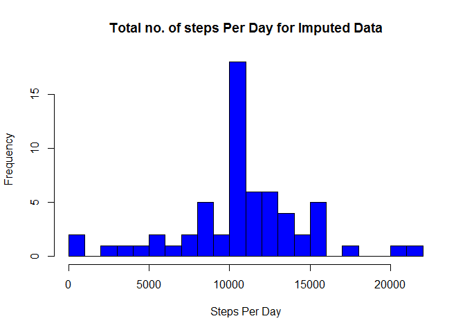

# Reproducible Research : Peer Assessment - 1
Prasanth S  
29 September 2017  


##Introduction
It is now possible to collect a large amount of data about personal movement using activity monitoring devices such as a Fitbit, Nike Fuelband, or Jawbone Up. These type of devices are part of the "quantified self" movement - a group of enthusiasts who take measurements about themselves regularly to improve their health, to find patterns in their behavior, or because they are tech geeks. But these data remain under-utilized both because the raw data are hard to obtain and there is a lack of statistical methods and software for processing and interpreting the data.

This assignment makes use of data from a personal activity monitoring device. This device collects data at 5 minute intervals through out the day. The data consists of two months of data from an anonymous individual collected during the months of October and November, 2012 and include the number of steps taken in 5 minute intervals each day.

The data for this assignment can be downloaded from the course web site:

Dataset: [Activity monitoring data](https://d396qusza40orc.cloudfront.net/repdata%2Fdata%2Factivity.zip) [52K]  

The variables included in this dataset are:  

- steps: Number of steps taking in a 5-minute interval (missing values are coded as NA)  
- date: The date on which the measurement was taken in YYYY-MM-DD format  
- interval: Identifier for the 5-minute interval in which measurement was taken  

The dataset is stored in a comma-separated-value (CSV) file and there are a total of 17,568 observations in this dataset.

##Loading and Preprocessing the Data

```r
#Check if the file exists or not before unzipping
filename <- "activity.csv"
if(!file.exists(filename))
    unzip("activity.zip")

#Load the Activity Data
activity_data <- read.csv(filename)
```

##What is mean total number of steps taken per day?

```r
#Calculate the total number of steps taken per day
total_steps <- aggregate(steps ~ date, data=activity_data, FUN=sum, na.rm=TRUE)

#Plot a histogram of the total number of steps taken each day
hist(total_steps$steps, xlab="Steps Per Day", main="Total no. of steps Per Day", col="blue",breaks = 30)
```

<!-- -->

```r
#Calculate the mean and median of the total number of steps taken per day
steps_mean <- format(mean(total_steps$steps), digits = 1)
steps_median <- format(median(total_steps$steps), digits = 1)
```
1. The Mean Value of Steps Per Day is **10766**
2. The Median Value of Steps Per Day is **10765**

##What is the average daily activity pattern?

```r
#Calculate average steps for each interval for all days
average_steps <- aggregate(steps~interval,activity_data,mean)

#Plot the Average number steps per Day by Interval
ggplot(average_steps,aes(interval,steps,col="red"))+
geom_line()+xlab("5-minute Interval")+ylab("Average Of all Days")
```

<!-- -->

```r
#Find the Interval with maximum average steps
max_interval <- average_steps[which.max(average_steps$steps),]
```
The maximum no. of steps for 5 minute interval is **835** which is **206.1698113**

##Imputing Missing Values

```r
#Calculate the total number of missing values in the dataset
missing_values <- sum(is.na(activity_data))
```
The Total no of missing values in the Dataset is **2304**


```r
#Create a new dataset that is equal to the original dataset but with the missing data filled in.
imputed_data <- activity_data
imputed_data$steps <- impute(imputed_data$steps, mean)

#Calculate the total number of steps taken per day
imputed_steps <- aggregate(steps ~ date, data=imputed_data, FUN=sum, na.rm=TRUE)

#Plot a histogram of the total number of steps taken each day
hist(imputed_steps$steps, xlab="Steps Per Day", main="Total no. of steps Per Day for Imputed Data", col="blue",breaks = 30)
```

<!-- -->

```r
#Calculate the mean and median of the total number of steps taken per day
imputed_steps_mean <- format(mean(imputed_steps$steps), digits = 1)
imputed_steps_median <- format(median(imputed_steps$steps), digits = 1)
```
1. The Mean Value of the Steps per Day for Imputed Data is **10766**
2. The Median Value of the Steps per Day for Imputed Data is **10766**

##What is the impact of imputing missing data on the estimates of the total daily number of steps?

- The Difference in the Mean Value of Imputed and Non Imputed Data is **0**
- The Difference in the Median Value of Imputed and Non Imputed Data is **1**

## Are there differences in activity patterns between weekdays and weekends?

```r
#Creating a new factor variable in the Dataset to indicate "WeekDay" or "WeekEnd"
imputed_data$datetype <- ifelse(weekdays(as.Date(imputed_data$date)) 
                                %in% c('Saturday','Sunday'),'weekend','weekday')

#Calculate average number of steps taken based on Interval and DateType
imputed_data_new <- aggregate(steps ~ interval + datetype, data = imputed_data, FUN=mean)

#Make a Panel Plot for Average no of Steps taken and Interval
ggplot(imputed_data_new, aes(interval, steps,col=datetype)) + geom_line() + facet_grid(datetype ~ .) + xlab("Interval") +ylab("Average Steps")
```

<!-- -->

##Conclusion

From the plotted graph it is clear that average no of. steps are higher during the weekdays comparing to the weekend
